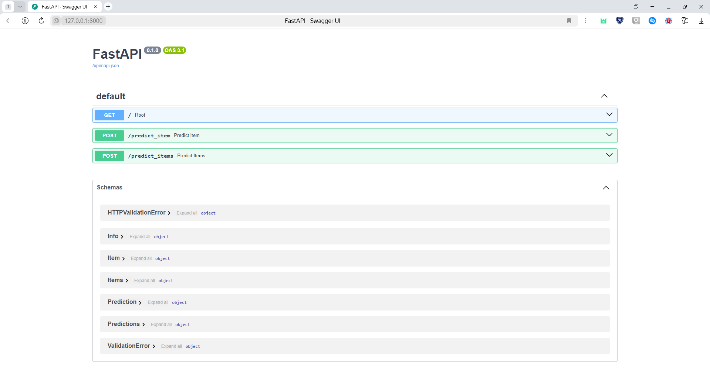
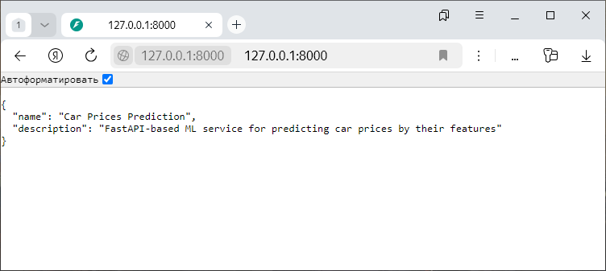
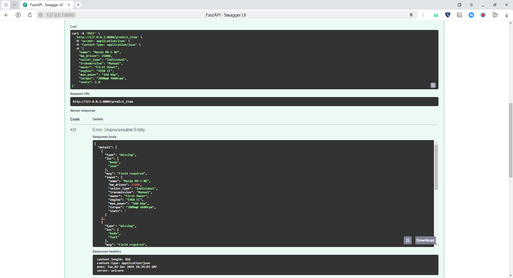
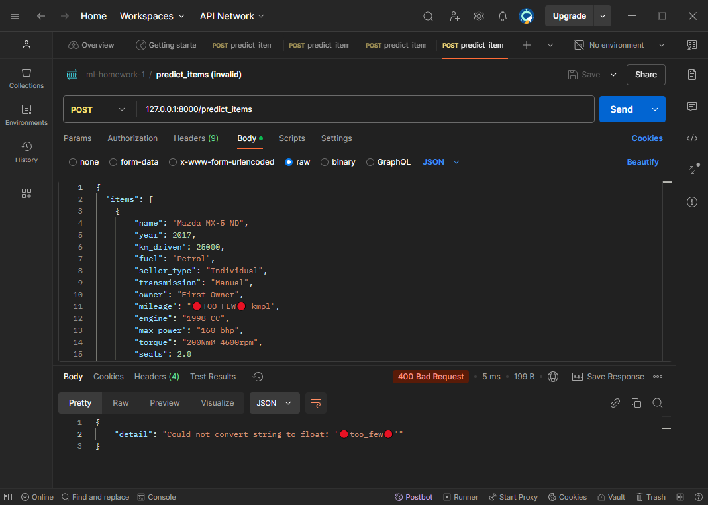

# Домашнее задание №1 (PRO)


## Оглавление

- [Структура проекта](#структура-проекта)
- [Установка зависимостей](#установка-зависимостей)
- [Локальный запуск сервера](#локальный-запуск-сервера)
- [Описание выполненной работы](#описание-выполненной-работы)
- [Тестирование приложения](#тестирование-приложения)
- [Примеры работы сервиса](#примеры-работы-сервиса)

## Структура проекта

- `experiments.ipynb` - Jupyter-ноутбук со всеми проведёнными в рамках ДЗ экспериментами.
- `app.py` - Файл с реализацией FastAPI-сервиса.
- `models.py` - Файл с пайплайном, включающим в себя обработку данных и применение линейной модели регрессии.
- `pipeline.pickle` - Pickle-файл, содержащий обученный пайплайн.
- `train_profile.html` и `test_profile.html` в папке `profiling_reports` - Файлы с отчётами YData Profiling.
- `README.md` - Файл с выводами о проделанной работе **_(данный файл)_**.
- Изображения в папке `example_img` - Примеры работы приложения из конца данного файла.
- `.gitignore`, `pyproject.toml`, `poetry.lock` - Служебные вспомогательные файлы Git и Poetry.

## Установка зависимостей

Для быстрого и удобного запуска проекта рекомендуется наличие менеджера зависимостей Poetry.
Создать виртуальное окружение и установить в него все необходимые проекту зависимости можно одной командой:

```bash
poetry install
```

## Локальный запуск сервера

Для запуска FastAPI-сервера локально можно воспользоваться следующей командой:

```bash
fastapi run app.py
```

## Описание выполненной работы

В рамках работы над домашним заданием я проделал следующие шаги.

### 1. Разведочный анализ данных (EDA)

На этом этапе я проанализировал исходные данные:
- Посмотрел, есть ли в данных пропуски и дубликаты.
- Сгенерировал отчеты с помощью YData Profiling.
- Посчитал различные статистики.
- Построил графики и корреляционные матрицы.
- Реализовал вычисление корреляции Спирмена.

По результатам анализа мне стало понятно, с какими данными я работаю
и какие преобразования над ними мне предстоит совершить.

### 2. Первоначальная обработка и очистка данных

На этом шаге я обработал входные данные, а именно:
- Удалил дубликаты (только в _train_).
- Обработал некоторые признаки и перевёл их в подходящие по смыслу типы.
- Заполнил пропуски в численных столбцах медианными значениями.

В качестве основного замечания могу сказать, что данные в столбце `torque`
были очень разного формата, и с ними пришлось повозиться.
Изначально я вообще просто удалял этот столбец, и от его добавления обратно
качество модели заметно не выросло.

### 3. Применение моделей только на числовых признаках

В данном пункте я применил различные линейные модели регрессии
только на числовых признаках из входных данных, а точнее:
- Использовал линейную регрессию.
- Вручную реализовал метрики R2 и Adjusted R2.
- Стандартизировал признаки.
- Снова применил линейную регрессию. Значения метрик не изменились.
- Использовал Lasso-регрессию. Значения метрик не изменились, никакие веса не занулились.
- Использовал подбор гиперпараметров Lasso-регрессии по сетке.
Качество модели стало несколько хуже. Некоторые веса занулились.
- Использовал подбор гиперпараметров ElasticNet-регрессии по сетке.
Лучшим значением гиперпараметра `l1_ratio` оказалось 1.0,
что по сути превращает ElasticNet в Lasso.
- Реализовал модель с L0-регуляризацией и использовал подбор гп по сетке.
Значения метрик получились сравнимы с остальными применёнными моделями.

Таким образом, масштабирование признаков и использование моделей с регуляризацией
не помогло добиться лучших значений метрик модели по сравнению с простой
линейной регрессией.

### 4. Обработка категориальных признаков

В этом пункте я:
- В столбце `name` оставил только первое слово - название (или начало названия) марки машины.
- Закодировал категориальные признаки при помощи One-Hot Encoding,
удаляя первый столбец для каждого признака.

После кодирования признаков получилось достаточно много.
Возможно, логичным было бы использовать для некоторых (или всех)
категориальных признаков другие методы кодирования.

### 5. Применение моделей на всех признаках

После завершения кодирования появилась возможность использовать все признаки
для получения предсказаний.

Я применил модель Ridge-регрессии с поиском оптимальных значений гиперпараметров по сетке.

Качество оказалось намного лучше, чем у моделей только на вещественных признаках.

### 6. Feature Engineering

В данном пункте я провёл несколько экспериментов, пытаясь получить новые признаки
для улучшения качества модели, а именно:
- Добавил признак, соответствующий примерному среднему пробегу автомобиля в год.
Метрики не улучшились.
- Логарифмировал признак `km_driven`. Метрики не улучшились.
- Повторно масштабировал признаки, теперь при помощи MinMaxScaler.
Значения метрик несколько снизились, но я всё равно оставил масштабирование.
- Добавил полиномиальные признаки второго порядка для всех признаков.
Значения метрик очень сильно увеличились, но суммарно получилось 1596 признаков,
что явно слишком много.
- Добавил полиномиальные признаки только для первоначально численных признаков.
Получилось 92 признака, что намного лучше, чем 1596.
Качество хоть и заметно хуже, чем в предыдущем подходе, но всё ещё
намного лучше качества совсем без полиномиальных признаков.

Из проведённых экспериментов в итоговой модели я применяю масштабирование
и полиномиальные численные признаки второго порядка.

### 7. Реализация и применение бизнес-метрик

В данном пункте я реализовал и применил кастомные "бизнес"-метрики:
- **Доля ответов, отличающихся от правильного на 10 или менее процентов.**
Лучшая по данной метрике модель: Ridge Regression 9 со значением метрики 0.387.
- **Доля ответов, отличающихся от правильного не более, чем на 10%, в меньшую сторону
и не более, чем на 20%, в большую сторону.**
Лучшая по данной метрике модель: Ridge Regression 9 со значением метрики 0.510.

### 8. Реализация FastAPI-сервиса

На данном шаге я собрал лучшую по своему мнению модель в пайплайн в файле `models.py`
и реализовал FastAPI-сервис в файле `app.py`.

Используемая модель включает в себя следующие шаги:
- Для числовых признаков:
  - Кастомная обработка некоторых признаков (`mileage`, `engine`, `max_power`, `torque`).
  - Заполнение пропусков медианой.
  - Масштабирование при помощи MinMaxScaler.
  - Добавление полиномиальных признаков 2 порядка.
- Для категориальных признаков:
  - Кастомная обработка некоторых признаков (`name`).
  - Заполнение пропусков модой (хоть их в изначальных данных и не было).
  - One-Hot Encoding с удалением первых столбцов.
- Lasso-регрессия.

В FastAPI-сервисе я немного отошёл от задания и для нескольких объектов принимал и возвращал
не CSV, а JSON, потому что с этим форматом данных намного удобнее и привычнее работать
в рамках взаимодействия с API при помощи HTTP-запросов.

Скриншоты работы реализованного приложения приведены ниже
в пункте [Примеры работы сервиса](#примеры-работы-сервиса).

### 9. Оформление результатов

В заключительном этапе моей работы я поместил все необходимые файлы
в репозиторий, а также создал и оформил данный README.

## Тестирование приложения

Для тестирования запущенного приложения можно воспользоваться следующими тестовыми данными.

### Пример 1

Запрос к `/predict_item`.

Тело запроса:

```json
{
    "name": "Mazda MX-5 ND",
    "year": 2017,
    "km_driven": 25000,
    "fuel": "Petrol",
    "seller_type": "Individual",
    "transmission": "Manual",
    "owner": "First Owner",
    "mileage": "15.15 kmpl",
    "engine": "1998 CC",
    "max_power": "160 bhp",
    "torque": "200Nm@ 4600rpm",
    "seats": 2.0
}
```

Ответ: `200 OK`

```json
{
    "selling_price": 1012203.95
}
```

### Пример 2

Запрос к `/predict_item`.

Тело запроса:

```json
{
    "name": "Mazda MX-5 ND",
    "km_driven": 25000,
    "seller_type": "Individual",
    "transmission": "Manual",
    "owner": "First Owner",
    "engine": "1998 CC",
    "max_power": "160 bhp",
    "torque": "200Nm@ 4600rpm",
    "seats": 2.0
}
```

Ответ: `422 Unprocessable Entity`

```json
{
    "detail": [
        {
            "type": "missing",
            "loc": [
                "body",
                "year"
            ],
            "msg": "Field required",
            "input": {
                "name": "Mazda MX-5 ND",
                "km_driven": 25000,
                "seller_type": "Individual",
                "transmission": "Manual",
                "owner": "First Owner",
                "engine": "1998 CC",
                "max_power": "160 bhp",
                "torque": "200Nm@ 4600rpm",
                "seats": 2.0
            }
        },
        {
            "type": "missing",
            "loc": [
                "body",
                "fuel"
            ],
            "msg": "Field required",
            "input": {
                "name": "Mazda MX-5 ND",
                "km_driven": 25000,
                "seller_type": "Individual",
                "transmission": "Manual",
                "owner": "First Owner",
                "engine": "1998 CC",
                "max_power": "160 bhp",
                "torque": "200Nm@ 4600rpm",
                "seats": 2.0
            }
        },
        {
            "type": "missing",
            "loc": [
                "body",
                "mileage"
            ],
            "msg": "Field required",
            "input": {
                "name": "Mazda MX-5 ND",
                "km_driven": 25000,
                "seller_type": "Individual",
                "transmission": "Manual",
                "owner": "First Owner",
                "engine": "1998 CC",
                "max_power": "160 bhp",
                "torque": "200Nm@ 4600rpm",
                "seats": 2.0
            }
        }
    ]
}
```

### Пример 3

Запрос к `/predict_items`.

Тело запроса:

```json
{
  "items": [
    {
        "name": "Mazda MX-5 ND",
        "year": 2017,
        "km_driven": 25000,
        "fuel": "Petrol",
        "seller_type": "Individual",
        "transmission": "Manual",
        "owner": "First Owner",
        "mileage": "15.15 kmpl",
        "engine": "1998 CC",
        "max_power": "160 bhp",
        "torque": "200Nm@ 4600rpm",
        "seats": 2.0
    },
    {
        "name": "Porsche 911 Targa 4S",
        "year": 2021,
        "km_driven": 20000,
        "fuel": "Petrol",
        "seller_type": "Individual",
        "transmission": "Automatic",
        "owner": "First Owner",
        "mileage": "11.11 kmpl",
        "engine": "2981 CC",
        "max_power": "450 bhp",
        "torque": "530Nm@ 5000rpm",
        "seats": 4.0
    }
  ]
}
```

Ответ: `200 OK`

```json
{
    "predictions": [
        {
            "selling_price": 1012203.95
        },
        {
            "selling_price": 8687094.44
        }
    ]
}
```

### Пример 4

Запрос к `/predict_items`.

Тело запроса:

```json
{
  "items": [
    {
        "name": "Mazda MX-5 ND",
        "year": 2017,
        "km_driven": 25000,
        "fuel": "Petrol",
        "seller_type": "Individual",
        "transmission": "Manual",
        "owner": "First Owner",
        "mileage": "🔴TOO_FEW🔴 kmpl",
        "engine": "1998 CC",
        "max_power": "160 bhp",
        "torque": "200Nm@ 4600rpm",
        "seats": 2.0
    },
    {
        "name": "Porsche 911 Targa 4S",
        "year": 2021,
        "km_driven": 20000,
        "fuel": "Petrol",
        "seller_type": "Individual",
        "transmission": "Automatic",
        "owner": "First Owner",
        "mileage": "11.11 kmpl",
        "engine": "2981 CC",
        "max_power": "450 bhp",
        "torque": "530Nm@ 5000rpm",
        "seats": 4.0
    }
  ]
}
```

Ответ: `400 Bad Request`

```json
{
    "detail": "Could not convert string to float: '🔴too_few🔴'"
}
```

## Примеры работы сервиса

### Страница Swagger-документации приложения



### Результат запроса к корню (`/`) в браузере



### Пример корректного запроса к `/predict_item` из Postman


### Пример некорректного запроса к `/predict_item` из документации



### Пример некорректного запроса к `/predict_items` из Postman


